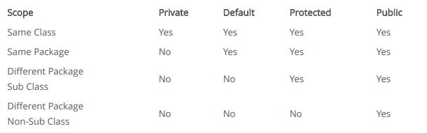

# Object oriented programing - OOP

**Summary**

- Inheritance
- Abstraction
- Encapsulation
- Polymorphism
- Exercise

---

## 1 .Inheritance 

-  A class can be sub-classed using the keyword **extends**.
- A class cannot extend more than one class.
- A class marked as final cannot be sub-classed.
- We can test the object type using the keyword instanceof.
- We can perform Is-A relationship test to identify the type of object.
- A constructor cannot be inherited.
- The child class inherits all the public and protected members of parent classes.
- The child class can override parent class methods.
- The child class can overload parent class methods.
- Inheritance makes it possible to re-use the code by extending existing
- classes without re-implementing the same logic.
- We can take advantage of polymorphism by using inheritance.

**Examples**

```java
// Inheritance Examples
// Package Level
public class Vehicle { }
public class Car extends Vehicle { }
public class Truck extends Vehicle { }
// Create Objects
Car car = new Car();
Truck truck = new Truck();
Vehicle myCar = new Car();
//IS-A relationship tests
// car Is-A Car
// car Is-A Vehicle
// truck Is-A Vehicle
// myCar Is-A Car
// myCar Is-A Vehicle
```


## 2. Abstraction

- Abstraction is the process to hide the implementation details and showing only the essential information to the user. Abstraction in Java can be achieved by using abstract classes and interfaces.

### 2.1 Abstract Classes

- A class can be declared as abstract by using the abstract keyword.
- Abstract classes cannot be marked as final.
- Abstract classes cannot be instantiated i.e. objects cannot be created using the new keyword.
- An abstract class must be sub-classed to create the objects.
- Methods without the implementation must be marked as abstract method using the abstract keyword.
- Abstract methods must end with semi-colon without the method body.
- The class must be abstract if it contains even a single abstract method.
- An abstract class can have zero to several abstract methods.
- An abstract class may implement the abstract methods of parent classes.
- The concrete class must implement all the abstract methods of parent classes.
- An abstract class may implement the abstract methods of the interfaces implemented by it.
- The concrete class must implement all the abstract methods of the interfaces implemented by it.
- The concrete class may leave the implementation of abstract methods if already implemented by the parent classes.

```java
public abstract class Vehicle { }
public abstract class Vehicle {
	public abstract String getName();
}
```

### 2.2 Interfaces

-  An Interface can be declared using the keyword interface.
-  An interface is implicitly abstract.
-  An interface can be either package level with default visibility or marked as public.
-  An interface can be implemented by any class.
-  The class implementing the interface must be marked as abstract if it does not implement all the abstract methods of the interface.
-  An interface can extend multiple interfaces.
-  An interface cannot implement another interface.
-  An interface cannot extend class.
-  All the interface methods are implicitly public and abstract unless declared as static or default.
-  All the variables defined in the interface are implicitly public, static and final.
-  Interface methods cannot be marked as final, strictfp, or native.
-  An interface cannot have constructor.

```java
public abstract interface Bounceable { }
public interface Bounceable { }
// Package Level
interface Bounceable { }
public interface Bounceable {
public void bounce();
```

## 3. Polymorphism

-  Polymorphism means many forms.
-  Same action can be performed in different ways. 
-  Any Java object which can pass more than one IS-A test can be considered polymorphic. All Java objects are polymorphic except the objects of class Object.
-  Upcasting - Reference variable of parent class refers to object of child class. Upcasting is implicit.
-  Downcasting - Reference variable of child class explicitly refers to reference variable of parent class which further refers to object of child class.
-  Types of polymorphism are compile-time polymorphism and runtime polymorphism.
-  The Compile-Time Polymorphism can be achieved by method overloading. It is also know as Static Polymorphism.
-  The Runtime Polymorphism can be achieved by method overriding. It is also know as Dynamic Method Dispatch.

## 4. Encapsulation

-  Hide implementation details behind a public interface or methods so that the implementation can be changed without breaking the code.

-  Variables of a class remains hidden from other classes using the private or protected access modifier.

-  The private or protected variables can be accessed by other classes using the getter and setter methods.

-  The getter and setter can implement logic before returning the variable or updating the variable.

-  The class controls the variable values.

-  The variables of a class can be made either read-only or write-only by omitting setter or getter.

-  A full-encapsulated class can declare all it's variables private.

-  Encapsulation is a way to hide data by denying direct access to the variables.

-  To use encapsulation for reference variables, the getter methods must return reference to the copy of the object.

- Keyword: 

	- **public** Visible within the same or other packages. 

	- **protected** Visible within the same package or child classes in same or other packages. 

	- **private** Visible within the same class. 

	- **none**(friendly) Visible within the same package.




## 5. Note

- Classes & objects
- constructors
- Modifiers 
- jvm & jit
- Association - Aggregation - Composition

## Exercise

